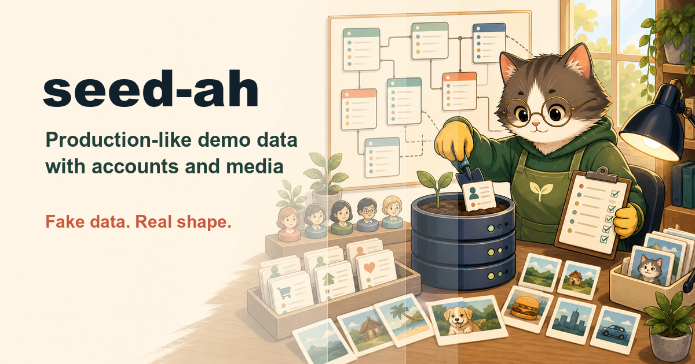

# seed-ah

**Seed demo databases with fake data that looks production-shaped — including
demo accounts, realistic relationships, and generated media.**

`seed-ah` is an [agent skill](https://vercel.com/docs/agent-resources/skills)
for the moment an empty database is blocking demos, screenshots, QA, or dev
work. It reads the real schema first, then builds a framework-native seed
that creates fake-but-production-like data: locale-correct names, realistic
timestamps, power-law activity, deliberate edge cases, image/media assets,
and a manifest that says exactly what was seeded.

The output always answers the practical demo question: **which account do I
log in with, what is the password, and what role does it have?**

## What it does

```
/seed-ah . volume: M locale: th_TH purpose: docs screenshots
```

1. **Frame + production gate** — resolves the actual DB connection, prints
   host/database/environment, and requires explicit confirmation before
   writing. Suspicious production-looking targets are refused or require the
   user to type the database name back. The gate is checked again at run
   time: the live connection's own identity must match what was confirmed,
   or nothing runs.
2. **Schema census** — answers a fixed census-question list from migrations,
   ORM models, and live DB introspection: tables, constraints, enum values,
   media columns, foreign-key dependency order, and what fires on insert
   (observers, triggers, queued jobs). Schema facts are cited with
   `file:line` or introspection output; unknowns become transactional
   probes, never guesses.
3. **Realism plan** — decides per-table shapes: locale-correct fake
   identities, spread timestamps, uneven production-like distributions,
   status coverage, rich accounts, empty accounts, and deliberate edge cases.
   Ends with a compact Seed Brief (target, row counts, marker, accounts)
   confirmed by the user before any script is written.
4. **Seed + unseed scripts** — writes the stack's own seeding mechanism
   (Laravel seeders, Prisma seed, Django management command, Rails seeds,
   Symfony fixtures, or plain SQL only as a last resort), deterministic and
   idempotent, plus a wipe script that deletes seeded rows by marker.
5. **Images and media** — generates or programmatically renders real files
   for image/file fields at the sizes the app expects. AI image generation is
   used when available; deterministic avatars/covers are the fallback. No real
   people, no scraped images.
6. **Run + verify** — re-checks the live target, records a pre-seed
   baseline, seeds a one-row walking skeleton per table, then runs the wipe
   for real and proves counts return to baseline — only then mass-seeds and
   checks row counts, FK integrity, every demo login through the app's real
   auth, and spot-renders major screens.
7. **Manifest** — writes `SEED_MANIFEST.md`: seeded counts, shape notes,
   image inventory, re-seed/wipe commands, and the demo accounts table with
   username/email, password, role, and what each account is good for demoing.

## Demo account contract

Every run reports demo credentials directly in the final response and in
`SEED_MANIFEST.md`:

| Login | Password | Role | Good for demoing |
|-------|----------|------|------------------|
| `admin@demo.example` | generated per seed | admin | settings and user management |
| `somchai.editor@demo.example` | generated per seed | editor | rich content/history flows |
| `newuser@demo.example` | generated per seed | member | onboarding and empty states |

The actual account list comes from the app's roles and permissions, not from
this template. Passwords are obviously fake, policy-compliant, and hashed
through the app's own hasher.

## Safety guarantees

- **No production writes without confirmation.** The target DB is shown before
  any mutation and its live identity is re-verified at run time. Headless
  runs write scripts but never execute the seed.
- **Wipeable by construction — and proven.** Seeded rows use a deterministic
  marker such as `@demo.example`, `demo-` slugs, or a seed-run tag column;
  the marker must match zero pre-existing rows, and the wipe round-trip is
  demonstrated on a one-row skeleton before any mass insert.
- **No real people or customer data.** Names, emails, images, and attachments
  are fake and safe for public screenshots.
- **Framework-native.** Seeds go through the app's model/factory layer where
  possible, so hashing, casts, defaults, UUIDs, and validation behave like the
  real app.

## The skill family

| Skill | Moment |
|-------|--------|
| [know-my-repo](https://github.com/silkyland/know-my-repo) | Day one: onboard onto a repo with zero knowledge |
| [deep-plan](https://github.com/silkyland/deep-plan) | Plan the next feature/refactor — evidence-gated, 7 phases |
| [deep-plan-ingest](https://github.com/silkyland/deep-plan) | Distill an accepted plan into living knowledge files |
| [clean-slate](https://github.com/silkyland/clean-slate) | Reset rotten knowledge files — backup-gated |
| [transform-my-repo](https://github.com/silkyland/transform-my-repo) | Change the architecture: migration feasibility + strategy |
| [twin-my-site](https://github.com/silkyland/twin-my-site) | Extend the web product with a native mobile twin |
| [jury-my-repo](https://github.com/silkyland/jury-my-repo) | Multi-agent adversarial audit with a verified verdict |
| [love-me-love-my-docs](https://github.com/silkyland/love-me-love-my-docs) | A user manual that regenerates itself |
| **seed-ah** | Fake-but-production-like demo data with a manifest |
| [create-my-team](https://github.com/silkyland/create-my-team) | Spawn and manage a subagent team for any mission |
| [reproduce-my-bug](https://github.com/silkyland/reproduce-my-bug) | Prove the bug before anyone fixes it |

Shared law: **no claim without evidence** — here applied to database shape and
seed results. No table is seeded unless it exists in the schema census, and no
demo account is reported unless its login was verified.

## Install

```bash
npx skills add silkyland/seed-ah
```

Or copy this directory into your agent's skills folder
(e.g. `~/.claude/skills/seed-ah/`).

## Structure

```
seed-ah/
├── SKILL.md                          # 7-step workflow + safety rules
└── references/
    ├── schema-census.md              # DB structure, constraints, FK graph
    ├── realism-guide.md              # Production-like fake data rules
    ├── images-and-media.md           # Image/file generation and storage rules
    └── manifest-template.md          # SEED_MANIFEST.md structure
```

Follows the [Vercel skills](https://github.com/vercel-labs/skills) single-skill
layout and [Anthropic's skill authoring best practices](https://platform.claude.com/docs/en/agents-and-tools/agent-skills/best-practices).

## License

MIT
